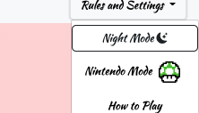

Hanafuda, known colloquially as Koi Koi or Sakura among a variety of other names, is a traditional Japanese matching card game. The deck consists of 48 cards divided into 12 months, with each month represented by a symbol of Japanese nature. Each tile corresponds to a certain point value, although how these values are given varies greatly across region and individual household. For this reason, I decided to build this game based on the house rules my grandmother taught me growing up-- an easy to pick-up-and-play variant somewhere in the middle of Koi Koi and the Hawaiian variant of Sakura. 

## **RULES**
2 players

At the start of the game, the deck is shuffled and 8 tiles are dealt to both players. Then, 8 cards are dealt into the "field", which is the center of play. 

  
   

The first player will select a tile from their hand and may either: 

1. Choose a tile with a matching suit in the field and collect both of them into their score-pile, or
2. Play a tile with no matching suit into the field, where it will stay and become fair game for the opponent.

Then, the top tile of the deck is revealed, and if it has a matching suit in the field, both are collected by the player into their score-pile. In the instance of multiple matching suits in the field, the highest value tile is selected. In the instance that 3 tiles of the same suit are in the field, revealing the 4th will automatically claim all 4.

The turn then passes to player 2, who repeats this process. 

The game ends when no player has tiles in their hands, and the deck is empty. Players then tally their scores and the highest score wins. Completed sets of specific cards are worth 50 points each, so it's often worth it to chase them in order to secure a victory! 

The combinations for these sets (also called Yaku), as well as a visual guide to the suits, is available within the game menu.

One final rule: 

'Fukeru': If either player manages to empty their entire hand with a score of or under 35 points, the game immediately ends in their victory. 

## Getting Started

The game is deployed on netlify at https://hanafuda-sakura.netlify.app/. Rules and information on the tile suits and different sets are available from the in-game menu. The game will offer an option to play again upon ending, but you may also reset at any time from the menu as well.

## Extras

Nintendo started out as a manufacturer of Hanafuda cards long before it became the gaming behemoth it is today. As a result, the company created a special Mario edition of the game, which has been ported over as an additional theme. You can select it from the top-menu, and because it's only a cosmetic theme, you can toggle between the normal and Mario modes to see what was added to the tiles. It even has it's own light and dark theme!

Mario Theme - Day         |  Mario Theme - Night
:-------------------------:|:-------------------------:
  |  

## Languages

* HTML
* CSS
* JavaScript

## Built With

* Bootstrap(https://getbootstrap.com/) - Components and light styling
* Bootstrap Icons (https://icons.getbootstrap.com/) - Light/Dark mode icons
* Animate.css(https://animate.style/) - Animations
* Gradient Animator (https://www.gradient-animator.com/) - BG gradients
* Hanafuda and Hanafuda Nintendo Tile sets courtesy of Wikipedia

## Authors

**Ian Terada** 

## Next Steps

* Improved Computer Logic
* Koi Koi Ruleset
* Mobile version

## Wireframe

## Pseudocode

Gameplay: 
1. Game draws hands (8 cards for each player)
2. Game deals 8 cards to the center
3. If four cards of the same suit are dealt into the field at the beginning, dealer captures all four.
4. Player 1 plays a card from their hand. If the card matches the suit of a card in the center, both cards are sent to that players score pile. 
5. Flip a card from the deck into the field. If a suit matches, capture both cards. 
6. If there are three cards of the same suit in the field and a player turns over the fourth matching card from the deck, that player captures all four cards at once.
7. Play ends with every player runs out of cards in their hand. 
(If not cards in hand, you flip. If no cards in deck, skip turn)

* AAU I expect the game to draw my initial hand for me
* AAU I expect to be able to click on a tile to play it into the game board
* AAU I expect to be able to select either the empty game board to play a non-scoring tile, or select a matching tile to send both to my scoring pile
(conditional on click)
* AAU I expect to be able to access a visual representation of my draw pile

Split JavaScript code into modules, with a Deck object and imported scoring arrays.

The Deck will need names which can be used to extract both value but also give meaningful distinction to the cards within individual suits, as images and scoring will both be looked up through the tile names, while rendering the field and the player hand can be managed through passing down tileID and splicing/pushing the tile name around. 
Player objects can be used to store hand and score-pile state, along with which tile is selected. Passing tile index to a separate state will prevent potentially having two sources of concurrent truth. 

The game will need logic to allow for a card to be played into the field and automatically select the highest value pair amongst multiple options. Naming the highest value tile of a set as the suit + 0 index should allow for a simple sort method, once all of the matching suits in the field are filtered. For instance, Grass0 will always sort before Grass1, and no manipulation of the name will be needed to infer value. 