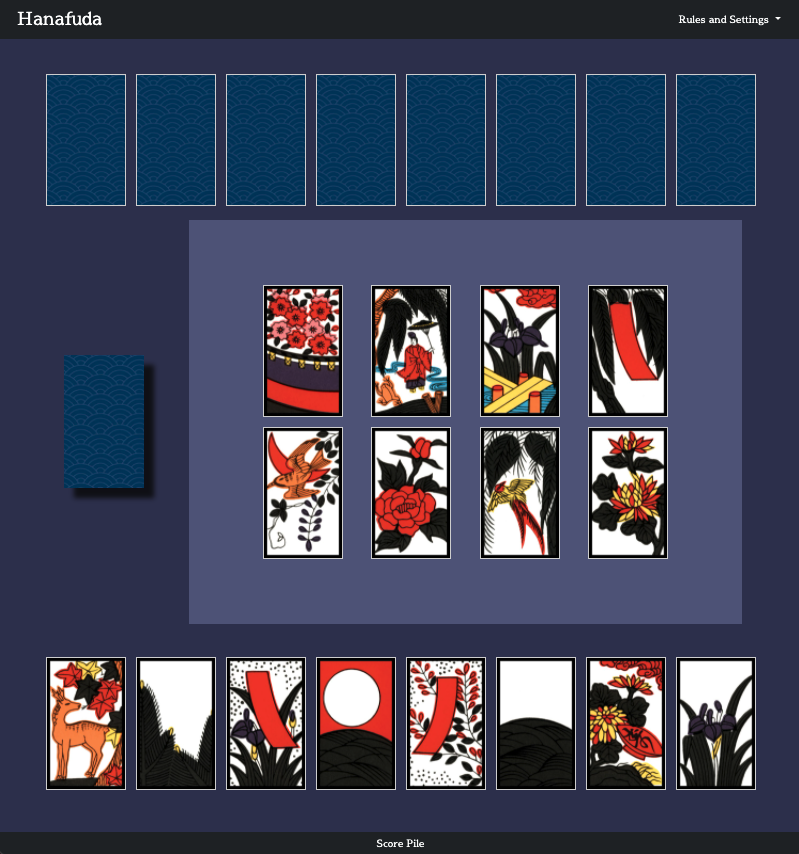

# Hanafuda

Hanafuda, known colloquially as Koi Koi or Sakura among a variety of other names, is a traditional Japanese matching card game. The deck consists of 48 cards divided into 12 months, which each month being represented by a symbol of Japanese nature. Each tile corresponds to a certain point value, although how these values are given varies greatly across region and even individual household. For this reason, I decided to build this game based on the house rules my grandmother taught me growing up-- an easy to pick-up-and-play varient somewhere in the middle of Koi Koi and the Hawaiian varient of Sakura. 

## **RULES**
2 players

At the start of the game, the deck is shuffled and 8 tile are dealt to both players. Then, 8 cards are dealt into the "field", which is the center of play. The first player will select a tile from their hand and may either: 

1. Choose a tile with a matching suit in the field and collect both of them into their scorepile, or
2. Play a tile with no matching suit into the field, where it will stay and become fair game for the opponent.

Then, the top tile of the deck is revealed, and if it has a matching suit in the field, both are collected by the player into their scorepile. In the instance of multiple matching suits in the field, the highest value tile is selected. In the instance 3 tiles of the same suit are in the field, revealing the 4th will automatically claim all 4.

The turn then passes to player 2, who repeats this process. 

The game ends when no player has tiles in their hands, and the deck is empty. Players then calculate their scores (or, in this case, it is done automatically) and the highest score wins. Sets, or Yaku, are worth 50 points each for completing them within your scorepile, so it's often worth it to chase them in order to secure a victory! 

The combinations for Yaku, as well as a visual guide to the suits, is available within the game menu.

One final rule: 

'Fukeru': If either player manages to empty their entire hand with a score of under 20 points, the game immediety ends in their victory. 

## Getting Started

The game is deployed on netlify at https://hanafuda-sakura.netlify.app/. The game will always start by dealing 8 tiles to both players and 8 tiles 
into the field, with the human player taking the first turn. Rules and information on the tile suits and different sets
are available from the ingame menu. The game will offer an option to play again upon ending, but you may also reset at 
any time from the menu as well. 

## Languages

* HTML
* CSS
* JavaScript

## Built With

* Bootstrap(https://getbootstrap.com/) - Components and light styling
* Bootstrap Icons (https://icons.getbootstrap.com/) - Light/Dark mode icons
* Animate.css(https://animate.style/) - Animations
* Hanafuda and Hanafuda Nintendo Tile sets courtesy of Wikipedia

## Authors

**Ian Terada** 

## Next Steps

* Improved Computer Logic
* Koi Koi Ruleset
* Custom card images

